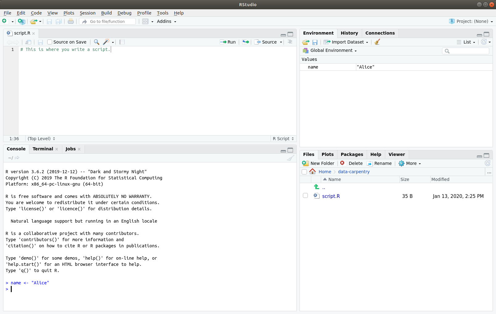
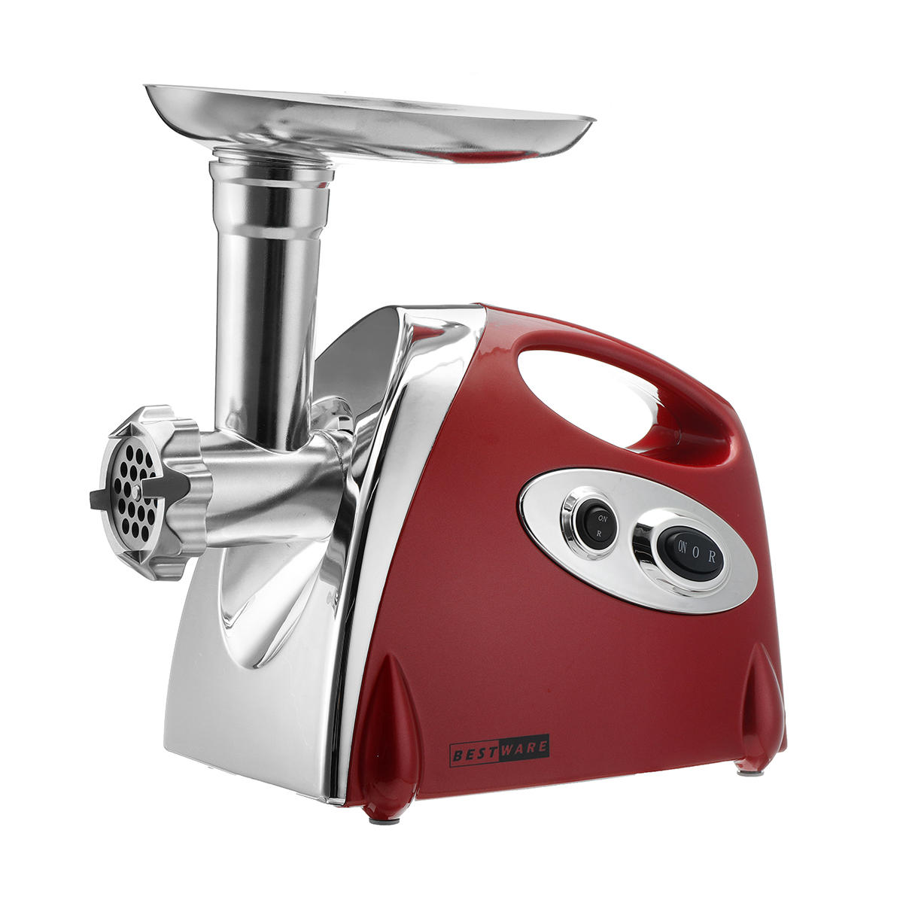

class: middle

```{r setup, include=FALSE}
knitr::opts_chunk$set(comment = NULL)
options(tibble.print_min = 5)
```

Detailed notes can be found at https://datacarpentry.org/r-socialsci/.

We'll be using [this dataset](http://www.datacarpentry.org/socialsci-workshop/data/).

---

## Some Inspiration

- [The R Graph Gallery](https://www.r-graph-gallery.com/)

---

class: inverse, center, middle

# Setup

---

## Installing R & RStudio

Detailed instructions at <https://bit.ly/36PeFFz>.

1. Install R.
2. Install RStudio.

---
class: inverse, center, middle

# Preliminaries

---

## What is R?

## What is RStudio?

---

## Why learn R?

- No more point-and-click
--

- Great for reproducibility
--

- Works with data of all shapes and sizes
--

- High quality graphics
--

- Interdisciplinary and extensible
--

- Large and welcoming community
--

- Free, Open Source and Cross-Platform

---
class: center, middle



---


<hr>

## Creating Structure

1. Create a project.
2. Create folder structure:

```
data/
data_output/
documents/
fig_output/
scripts/
```

You can create the folders using either (a) the Files tab or (b) the `dir.create()` function.

---

## Working Folder

This is where everything happens.

---


<hr>

## Getting Data

Download the `SAFI_clean.csv` dataset from <https://ndownloader.figshare.com/files/11492171>.

Either:

- manually or
- with code (using `download.file()`).

---
## Interacting with RStudio

In the console: use <kbd>Enter</kbd> to run a command.

--

In a script: use <kbd>Ctrl</kbd>+<kbd>Enter</kbd> (or <kbd>Cmd</kbd>+<kbd>Return</kbd>) to run a command.

--

Other handy shortcuts:

- <kbd>Ctrl</kbd>+<kbd>L</kbd> &mdash; clean console
- <kbd>Ctrl</kbd>+<kbd>1</kbd> &mdash; shift focus to editor
- <kbd>Ctrl</kbd>+<kbd>2</kbd> &mdash; shift focus to console
- <kbd>Ctrl</kbd>+<kbd>Shift</kbd>+<kbd>c</kbd> &mdash; comment/uncomment block
- <kbd>Ctrl</kbd>+<kbd>i</kbd> &mdash; fix indentation

---
## Getting Help

You can ask for help:

- on Stack Overflow
- on Twitter
- on R mailing lists.

**But do your homework first!**

Also used the integrated help.

```{r eval = FALSE}
?glm
??Poisson
```

---
## Installing Packages

There are two ways to do this:

- using the Packages tab or
- using code.

---


<hr>

## Install a Package

Install the `tidyverse` package.

---
class: inverse, center, middle

# Introduction to R

---

## R is a Fancy Scientific Calculator

```{r}
3 + 5
12 / 7
```

---

## Creating Variables

This works:

```{r}
area_hectares = 1.0
```

This is preferred:

```{r}
area_hectares <- 1.0
```

Shortcut for assignment operator: <kbd>Alt</kbd>+<kbd>-</kbd>.

---

## Creating Variables

```{r}
area_hectares <- 7 * 5
```

--

```{r}
(area_hectares <- 7 * 5)
```

---

You can do maths with variables.

```{r}
# Convert hectares to acres.
area_hectares * 2.47
```

Store the result in a new variable.

```{r}
(area_acres <- area_hectares * 2.47)
```

---


<hr>

## Creating Variables

```{r eval = FALSE}
area_hectares <- 5
(area_acres <- area_hectares * 2.47)
```

What happens if we change the value of `area_hectares`?

```{r eval = FALSE}
area_hectares <- 10
```

What's the value of `area_acres` now?

---

## Comments

Anything after a `#` is treated as a comment.

**Comments are very important.**

```{r eval = FALSE}
area_hectares <- 1                  # Land area in hectares
area_acres <- area_hectares * 2.47  # Convert to acres
area_acres                          # Print land area in acres
```

```{r eval = FALSE}
# Land area in hectares
area_hectares <- 1
# Convert to acres
area_acres <- area_hectares * 2.47
# Print land area in acres
area_acres
```

---


<hr>

## Commenting Code

- Create two variables, `length` and `width`, and assign them values.
- Create a variable `area` with a value based on the current values of `length` and `width`.
- Show that changing the values of either `length` and `width` does not affect the value of `area`.
- Comment your code.

---

## Functions

.center[

]

---

## Functions

```{r}
round(3.14159)
```

--

What does `round()` do? Check the documentation.

```{r eval = FALSE}
?round
```

--

```{r}
round(3.14159, digits = 2)
round(3.14159, 2)
round(digits = 2, x = 3.14159)
```

---


<hr>

## Function Documentation

What other functions are similar to `round()`? Give them a try.

---

## Vectors

Vectors allow you to store a collection of values.

```{r}
# Number of people in households.
(hh_members <- c(3, 7, 10, 6))
# Material used for construction.
respondent_wall_type <- c("muddaub", "burntbricks", "sunbricks")
```

--

How many elements in a vector?

```{r}
length(hh_members)
```

---

## Vectors

What is the data type of those vectors?

```{r}
class(hh_members)
class(respondent_wall_type)
```

All elements of a vector must be of the same type.

---

## Vectors

Adding elements to a vector.

```{r}
possessions <- c("bicycle", "radio", "television")
possessions <- c(possessions, "mobile_phone")      # Add to the end of the vector
possessions <- c("car", possessions)               # Add to the beginning of the vector
possessions
```

---


<hr>

## Mixing Type in Vectors

A vector can only contain a single type. What happens in the following code?

```{r eval = FALSE}
num_char <- c(1, 2, 3, "a")
num_logical <- c(1, 2, 3, TRUE)
char_logical <- c("a", "b", "c", TRUE)
tricky <- c(1, 2, 3, "4")
```

---


<hr>

## Combining Vectors

```{r eval = FALSE}
num_logical <- c(1, 2, 3, TRUE)
char_logical <- c("a", "b", "c", TRUE)
combined_logical <- c(num_logical, char_logical)
```

How many values in `combined_logical` are `"TRUE"`?

---

## Slicing Vectors

```{r}
hh_members
hh_members[2]
hh_members[c(1, 3)]
hh_members[1:3]
hh_members[-4]
```

---

## Slicing Vectors

```{r}
hh_members
hh_members[c(TRUE, FALSE, TRUE, FALSE)]
hh_members[hh_members > 6]
hh_members[hh_members > 6 & hh_members < 10]
hh_members[hh_members > 6 | hh_members < 4]
```

---

## Missing Data

Missing data is indicated by `NA`.

```{r}
rooms <- c(2, 1, 1, NA, 4)
mean(rooms)
```

--

```{r}
mean(rooms, na.rm = TRUE)
```

---

## Missing Data

```{r}
rooms[!is.na(rooms)]
na.omit(rooms)
```

---


<hr>

## Missing Data

```{r}
rooms <- c(1, 2, 1, 1, NA, 3, 1, 3, 2, 1, 1, 8, 3, 1, NA, 1)
```

1. Create a new vector with `NA` values removed.
2. Use `median()` to calculate the median value of `rooms`.
3. Use R to find out how many households have *more than* 2 rooms.

---
class: inverse, center, middle

# Starting with Data

---

## Loading Data

Load the `tidyverse`.

```{r warning=FALSE, message=FALSE}
library(tidyverse)
```

--

Load data.

```{r message=FALSE}
interviews <- read_csv("data/SAFI_clean.csv", na = "NULL")
```

Assumes that the file is comma delimited.

--

```{r}
class(interviews)
```

---

## Loading Data

```{r}
interviews
```

---

## Inspecting the Data

```{r}
head(interviews)
```

---

## Inspecting the Data

```{r}
tail(interviews)
```

---

## Inspecting the Data

```{r}
dim(interviews)
nrow(interviews)
ncol(interviews)
```

--

```{r}
names(interviews)
```

---

## Slicing the Data

The first row.

```{r}
interviews[1,]
```

---

## Slicing the Data

The first column (as a data frame).

```{r}
interviews[, 1]
```

---

## Slicing the Data

The first column by name.

```{r}
interviews[, "key_ID"]
```

---

## Slicing the Data

The first column as a vector.

```{r}
interviews$key_ID
```

---

## Slicing the Data

Specifying row and column.

```{r}
interviews[3:5, 2]
```

---


<hr>

## Data Frames

1. Create a data frame (`interviews_100`) containing only the data in row 100 of `interviews`.
2. Remember that `nrow()` gave you the number of rows in a data frame?

  - Use that number to pull out just that last row in the data frame.
  - Compare that with what you see as the last row using `tail()` to make sure it’s correct.
  - Pull out that last row using `nrow()` instead of the row number.
  - Create a new data frame (`interviews_last`) from that last row.

3. Use `nrow()` to extract the middle row of the data frame. Store the result in `interviews_middle`.

---

## Factors

```{r}
respondent_floor_type <- factor(c("earth", "cement", "cement", "earth"))
```

--

```{r}
levels(respondent_floor_type)
nlevels(respondent_floor_type)
```

--

What's happening behind the scenes?

```{r}
as.integer(respondent_floor_type)
```

---

## Order of Levels

```{r}
respondent_floor_type
```

--

Change order.

```{r}
(respondent_floor_type <- factor(respondent_floor_type, levels = c("earth", "cement")))
```

---

## Converting Factors

This works.

```{r}
as.character(respondent_floor_type)
```

--

This doesn't work.

```{r}
year_fct <- factor(c(1990, 1983, 1977, 1998, 1990))
as.numeric(year_fct)
```

--

This works.

```{r}
as.numeric(as.character(year_fct))
```

---

## Renaming Factors

```{r}
memb_assoc <- as.factor(interviews$memb_assoc)
memb_assoc
```

--

```{r}
table(memb_assoc)
```

What happened to the missing data?

---

## Renaming Factors

```{r}
memb_assoc <- interviews$memb_assoc
memb_assoc[is.na(memb_assoc)] <- "???"
(memb_assoc <- as.factor(memb_assoc))
```

--

```{r}
table(memb_assoc)
```

---


<hr>

## Factors

```{r}
levels(memb_assoc)
```

1. Rename the levels of the factor to have the first letter in uppercase: "???", "No" and "Yes".
2. Change the order of the levels so that `???` is last.

---

## Formatting Dates

```{r}
dates <- interviews$interview_date
head(dates)
class(dates)
```

---

## Formatting Dates

```{r warning=FALSE, message=FALSE}
library(lubridate)
```

Use functions from the `lubridate` package to extract date parts.

```{r}
interviews$day <- day(dates)
interviews$month <- month(dates)
interviews$year <- year(dates)
interviews[, c("interview_date", "year", "month", "day")]
```

---
class: inverse, center, middle

# Introducing dplyr and tidyr

---

## What is an R package?

Let's take a look at [CRAN](http://cran.r-project.org/).

--

Installing a package.

```{r eval = FALSE}
install.packages("survey")
```

--

Loading a package.

```{r eval = FALSE}
library(survey)
```

It's a bit like buying a book. Why?

--

Getting help on a package.

```{r eval = FALSE}
help(package = "survey")
library(help = "survey")
```

---

## Loading dplyr and tidyr

```{r}
library(tidyverse)
```

```{r}
library(dplyr)
library(tidyr)
```

---

## Selecting columns

```{r}
select(interviews, village, no_membrs, years_liv)
```

---

## Filtering rows

```{r}
filter(interviews, village == "God")
```

---

## The Pipe

How to apply multiple operations?

--

One approach.

```{r}
interviews2 <- filter(interviews, village == "God")
interviews_god <- select(interviews2, no_membrs, years_liv)
```

--

Another approach (nesting functions).

```{r}
interviews_god <- select(filter(interviews, village == "God"), no_membrs, years_liv)
```

---

## The Pipe

```{r}
interviews %>%
    filter(village == "God") %>%
    select(no_membrs, years_liv)
```

Keyboard shortcut: <kbd>Ctrl</kbd>+<kbd>Shift</kbd>+<kbd>m</kbd>.

---


<hr>

## Pipe

Using pipes, subset `interviews` to include interviews where

- respondents were members of an irrigation association (`memb_assoc`) and
- retain only the columns `affect_conflicts`, `liv_count` and `no_meals`.

---

## Mutating

```{r}
interviews %>%
    mutate(people_per_room = no_membrs / rooms)
```

---

## Mutating

Investigate whether being a member of an irrigation association has an effect on the ratio of household members to rooms.

--

```{r}
interviews %>%
  filter(!is.na(memb_assoc)) %>%
  mutate(people_per_room = no_membrs / rooms) %>%
  select(memb_assoc, people_per_room)
```

---


<hr>

## Mutate

Create a new data frame from `interviews` that meets the following criteria:

- contains only the `village` column and
- a new column called `total_meals` (total number of meals served in the household per day on average, `no_membrs` times `no_meals`).

Only the rows where total_meals is greater than 20 should be shown in the final data frame.

**Hint:** think about how the commands should be ordered to produce this data frame!

---

## Summary Statistics

```{r}
interviews %>%
  group_by(village) %>%
  summarize(mean_no_membrs = mean(no_membrs))
```

---

## Summary Statistics

Grouping by multiple columns.

```{r}
interviews %>%
  group_by(village, memb_assoc) %>%
  summarize(mean_no_membrs = mean(no_membrs))
```

---

## Summary Statistics

Throwing in a `filter()`.

```{r}
interviews %>%
  filter(!is.na(memb_assoc)) %>%
  group_by(village, memb_assoc) %>%
  summarize(mean_no_membrs = mean(no_membrs))
```

---

## Summary Statistics

Create multiple summaries.

```{r}
interviews %>%
  filter(!is.na(memb_assoc)) %>%
  group_by(village, memb_assoc) %>%
  summarize(
    mean_no_membrs = mean(no_membrs),
    min_membrs = min(no_membrs)
  )
```

---

## Summary Statistics

Sort the results.

```{r}
interviews %>%
  filter(!is.na(memb_assoc)) %>%
  group_by(village, memb_assoc) %>%
  summarize(mean_no_membrs = mean(no_membrs), min_membrs = min(no_membrs)) %>%
  arrange(min_membrs)
```

---

## Summary Statistics

Reverse order of sort.

```{r}
interviews %>%
  filter(!is.na(memb_assoc)) %>%
  group_by(village, memb_assoc) %>%
  summarize(mean_no_membrs = mean(no_membrs), min_membrs = min(no_membrs)) %>%
  arrange(desc(min_membrs))
```

---

## Counts

```{r}
interviews %>%
    count(village)
```

```{r}
interviews %>%
    count(village, sort = TRUE)
```

---


<hr>

## Summaries

- How many households in the survey have an average of two meals per day? Three meals per day? Are there any other numbers of meals represented?
- Use `group_by()` and `summarize()` to find the mean, min, and max number of household members for each village. Also add the number of observations (**Hint:** see `?n`).
- What was the largest household interviewed in each month?

---

## Reshaping with gather and spread

- `spread()` &mdash; make data wide
- `gather()` &mdash; make data long

---

## Spreading

`spread()` takes three principal arguments:

- the data
- the key column (values will become new column names)
- the value column (values will fill the new column variables)

---

## Spreading

```{r}
interviews %>%
  select(instanceID, respondent_wall_type, no_membrs)
```

---

## Spreading

```{r}
interviews_spread <- interviews %>%
  select(instanceID, respondent_wall_type, no_membrs) %>%
  spread(respondent_wall_type, no_membrs)
interviews_spread
```

---

## Spreading

```{r}
interviews %>%
  select(instanceID, respondent_wall_type, no_membrs) %>%
  spread(respondent_wall_type, no_membrs, fill = 0)
```

---

## Gathering

`gather()` takes four principal arguments:

- the data
- the key column (variable to create from column names)
- the value column (variable to create and fill with values associated with the key)
- the names of the columns to gather.

---

## Gathering

```{r}
interviews_spread %>%
  gather(respondent_wall_type, no_membrs, burntbricks, cement, muddaub, sunbricks)
```

---

## Gathering

```{r}
interviews_spread %>%
  gather(respondent_wall_type, no_membrs, -instanceID)
```

---

## Cleaning

This column is hard to work with:

```{r}
interviews %>%
  select(key_ID, items_owned)
```

---

## Cleaning

We can fix that.

```{r eval = FALSE}
interviews %>%
  separate_rows(items_owned, sep=";") %>%
  mutate(items_owned_logical = TRUE) %>%
  spread(key = items_owned, value = items_owned_logical, fill = FALSE)
```

---


<hr>

## Cleaning

- Create `interviews_months_lack_food` that has one column for each month and records `TRUE` or `FALSE` for whether each interview respondent was lacking food in that month.
- How many months (on average) were respondents without food if they did belong to an irrigation association? What about if they didn't?

---

## Exporting

```{r}
interviews_plotting <- interviews %>%
    # Spread data by items_owned
    separate_rows(items_owned, sep=";") %>%
    mutate(items_owned_logical = TRUE) %>%
    spread(key = items_owned, value = items_owned_logical, fill = FALSE) %>%
    rename(no_listed_items = `<NA>`) %>%
    # Spread data by months_lack_food
    separate_rows(months_lack_food, sep=";") %>%
    mutate(months_lack_food_logical = TRUE) %>%
    spread(key = months_lack_food, value = months_lack_food_logical, fill = FALSE) %>%
    # Add summary columns
    mutate(number_months_lack_food = rowSums(select(., Apr:Sept))) %>%
    mutate(number_items = rowSums(select(., bicycle:television)))
```
```{r eval = FALSE}
write_csv(interviews_plotting, path = "data_output/interviews_plotting.csv")
```

---
class: inverse, center, middle

# Data Visualisation with ggplot2

